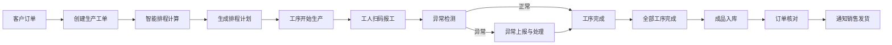
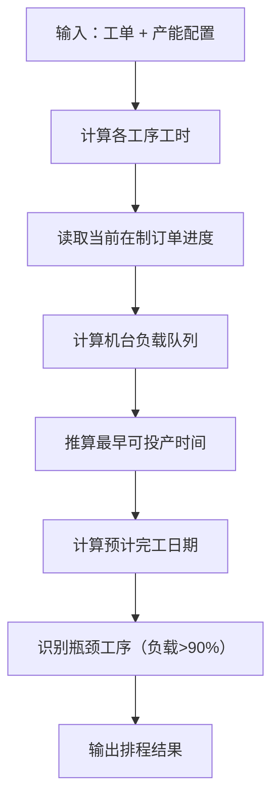

## 1. 产品概述

工厂生产排程与工单管理系统是一套面向制造企业的生产管理解决方案，涵盖从订单接收到成品入库的全流程管理。系统通过智能排程算法优化生产计划，实时追踪生产进度，帮助企业提升生产效率、降低交付风险。

- **目标用户**：生产计划员、车间工人、客服人员、生产管理人员
- **核心价值**：智能排程降本提效、实时可视化生产进度、数据驱动决策

## 2. 核心功能

### 2.1 用户角色

| 角色 | 核心权限 |
|------|----------|
| 生产计划员 | 创建工单、排程管理、产能配置 |
| 车间工人 | 扫码报工、异常上报、查看工序任务 |
| 客服人员 | 订单追踪、交货期预测、发货通知 |
| 生产管理员 | 数据看板、指标监控、入库管理 |

### 2.2 功能模块

1. **订单管理**：生产工单创建、产品型号配置、交货期管理
2. **生产排程**：智能排程引擎、产能计算、瓶颈识别、排程甘特图
3. **生产报工**：扫码报工、工序进度记录、产量统计
4. **异常管理**：停机上报、质量问题、异常处理流程
5. **订单追踪**：实时进度展示、交货期风险预警
6. **成品入库**：入库录入、订单核对、发货通知
7. **数据看板**：设备利用率、工序合格率、准时交货率

### 2.3 页面详情

| 页面名称 | 模块名称 | 功能描述 |
|---------|---------|---------|
| 工作台首页 | 核心指标卡 + 待办事项 | 展示今日产量、设备状态、待处理异常、紧急订单 |
| 订单管理 | 工单列表 + 新建工单 | 工单CRUD、产品型号选择、数量与交货期设置 |
| 生产排程 | 甘特图 + 瓶颈分析 | 自动排程、手动调整、产能瓶颈识别 |
| 生产报工 | 工序任务列表 + 扫码报工 | 工序开始/完成、产量录入、扫码快速操作 |
| 异常管理 | 异常列表 + 异常上报 | 停机/质量问题上报、处理状态追踪 |
| 订单追踪 | 订单进度 + 风险预警 | 实时进度百分比、交货期预测、风险标识 |
| 成品入库 | 入库单 + 订单核对 | 成品入库、数量核对、发货状态 |
| 数据看板 | 多维度图表 | 设备利用率、工序合格率、准时交货率统计 |

## 3. 核心流程

### 3.1 生产全流程

### 3.2 排程算法流程

## 4. 用户界面设计

### 4.1 设计风格

- **主色调**：工业蓝（#165DFF）作为主色，体现专业与可信赖
- **辅助色**：成功绿（#00B42A）、警告橙（#FF7D00）、危险红（#F53F3F）
- **背景色**：深灰背景（#1D2129）+ 卡片深灰（#272E3B），深色工业风
- **字体**：JetBrains Mono 等宽字体用于数据展示，搭配 Roboto 标题字体
- **布局风格**：左右分栏 + 卡片式布局，信息密度高，符合生产管理场景
- **图标风格**：线性图标，工业感强，统一2px描边
- **按钮风格**：直角微圆（4px圆角），实心按钮带轻微阴影

### 4.2 页面设计概览

| 页面名称 | 模块名称 | UI元素 |
|---------|---------|--------|
| 工作台 | 指标卡网格 | 渐变指标卡、数据动画、趋势小图 |
| 生产排程 | 甘特图区域 | 时间轴、彩色工序条、拖拽交互 |
| 订单追踪 | 进度时间线 | 垂直时间线、状态点、风险标签 |
| 数据看板 | 图表区域 | 柱状图、折线图、环形图、数据表格 |

### 4.3 响应式

- 桌面端优先（1920×1080），适配常见生产管理大屏
- 平板端适配报工场景，支持触摸操作
- 移动端适配订单追踪和异常查看

### 4.4 视觉特色

- 深色工业风主题，降低长时间使用的视觉疲劳
- 数据高亮显示，关键指标带脉冲动画
- 甘特图支持渐变色工序条，瓶颈工序闪烁警示
- 状态指示器使用信号灯式设计（红黄绿）
