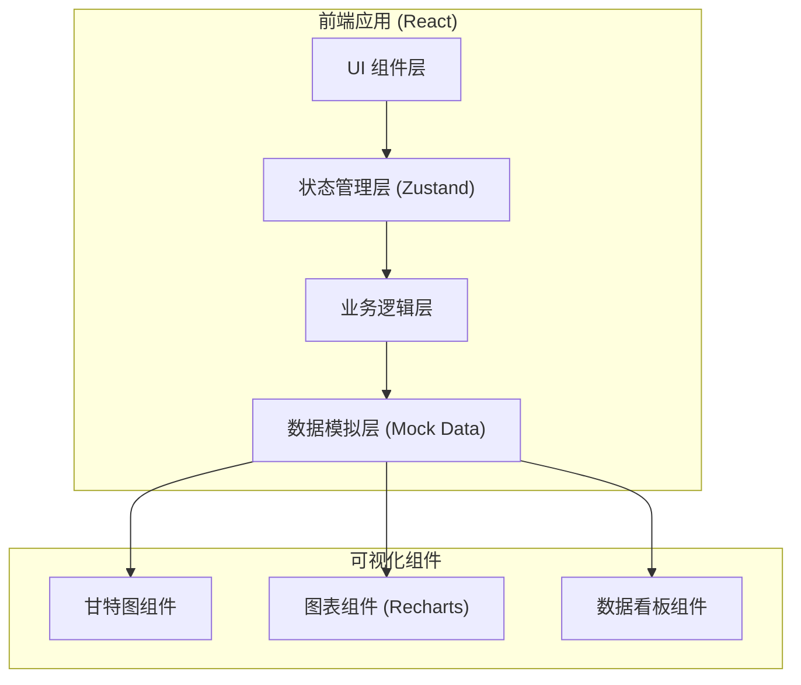
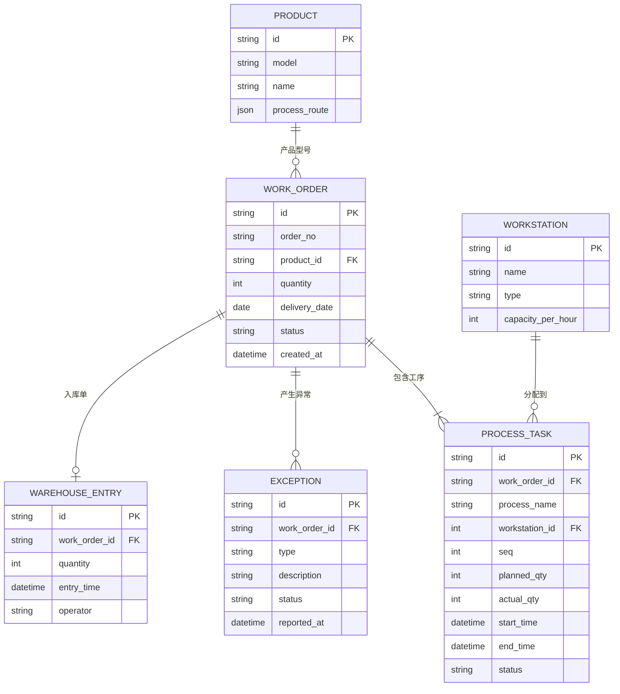

## 1. 架构设计



## 2. 技术描述

- **前端框架**：React@18 + TypeScript
- **构建工具**：Vite@5
- **样式方案**：TailwindCSS@3
- **状态管理**：Zustand
- **UI组件库**：无（自定义组件，保持设计独特性）
- **图表库**：Recharts
- **路由**：React Router@6
- **数据方案**：Mock 数据 + localStorage 持久化
- **图标**：Lucide React

## 3. 路由定义

| 路由 | 页面名称 | 用途 |
|-----|---------|------|
| /dashboard | 工作台首页 | 核心指标概览、待办事项 |
| /orders | 订单管理 | 工单列表、新建/编辑工单 |
| /scheduling | 生产排程 | 排程甘特图、瓶颈分析 |
| /reporting | 生产报工 | 工序任务、扫码报工 |
| /exceptions | 异常管理 | 异常列表、异常上报 |
| /tracking | 订单追踪 | 订单进度、风险预警 |
| /warehouse | 成品入库 | 入库单、订单核对 |
| /analytics | 数据看板 | 多维度统计图表 |

## 4. 数据模型

### 4.1 数据模型定义



### 4.2 核心数据结构

```typescript
// 产品
interface Product {
  id: string;
  model: string;
  name: string;
  processRoute: ProcessStep[];
}

interface ProcessStep {
  name: string;
  workstationType: string;
  cycleTime: number; // 分钟/件
}

// 工单
interface WorkOrder {
  id: string;
  orderNo: string;
  productId: string;
  productName: string;
  productModel: string;
  quantity: number;
  deliveryDate: string;
  status: 'pending' | 'scheduled' | 'producing' | 'completed' | 'warehoused';
  createdAt: string;
  scheduledStartDate?: string;
  estimatedCompletionDate?: string;
  actualCompletionDate?: string;
}

// 工序任务
interface ProcessTask {
  id: string;
  workOrderId: string;
  workOrderNo: string;
  processName: string;
  workstationId: string;
  workstationName: string;
  seq: number;
  plannedQty: number;
  actualQty: number;
  startTime?: string;
  endTime?: string;
  status: 'pending' | 'in_progress' | 'completed';
  qualifiedQty: number;
  defectQty: number;
}

// 设备/工位
interface Workstation {
  id: string;
  name: string;
  type: string;
  capacityPerHour: number;
  status: 'running' | 'idle' | 'maintenance' | 'down';
  currentTaskId?: string;
}

// 异常
interface Exception {
  id: string;
  workOrderId: string;
  workOrderNo: string;
  processName: string;
  type: 'downtime' | 'quality' | 'material' | 'other';
  description: string;
  status: 'reported' | 'handling' | 'resolved';
  reportedAt: string;
  resolvedAt?: string;
  handler?: string;
}

// 入库单
interface WarehouseEntry {
  id: string;
  workOrderId: string;
  workOrderNo: string;
  productName: string;
  quantity: number;
  entryTime: string;
  operator: string;
  remark?: string;
}
```

## 5. 排程算法设计

### 5.1 核心算法逻辑

1. **输入数据**：
   - 待排程工单（产品、数量、交货期）
   - 各工序标准工时（cycleTime）
   - 机台数量与产能（capacityPerHour）
   - 当前在制订单及进度

2. **排程计算**：
   - 按交货期优先级排序工单
   - 对每个工单的每道工序：
     - 计算该工序总工时 = 数量 × 单件工时
     - 获取该工序对应机台的任务队列
     - 找到最早可用机台，计算最早开始时间
     - 计算结束时间 = 开始时间 + 总工时 / 机台数
   
3. **瓶颈识别**：
   - 统计各工序/机台的负载率
   - 负载率 > 90% 标记为瓶颈
   - 显示瓶颈影响的订单数量

### 5.2 状态管理

使用 Zustand 管理全局状态，按功能模块划分 store：
- `useOrderStore`：工单数据与操作
- `useScheduleStore`：排程计算与结果
- `useReportingStore`：报工记录
- `useExceptionStore`：异常管理
- `useWorkstationStore`：设备管理
- `useAnalyticsStore`：统计指标计算
